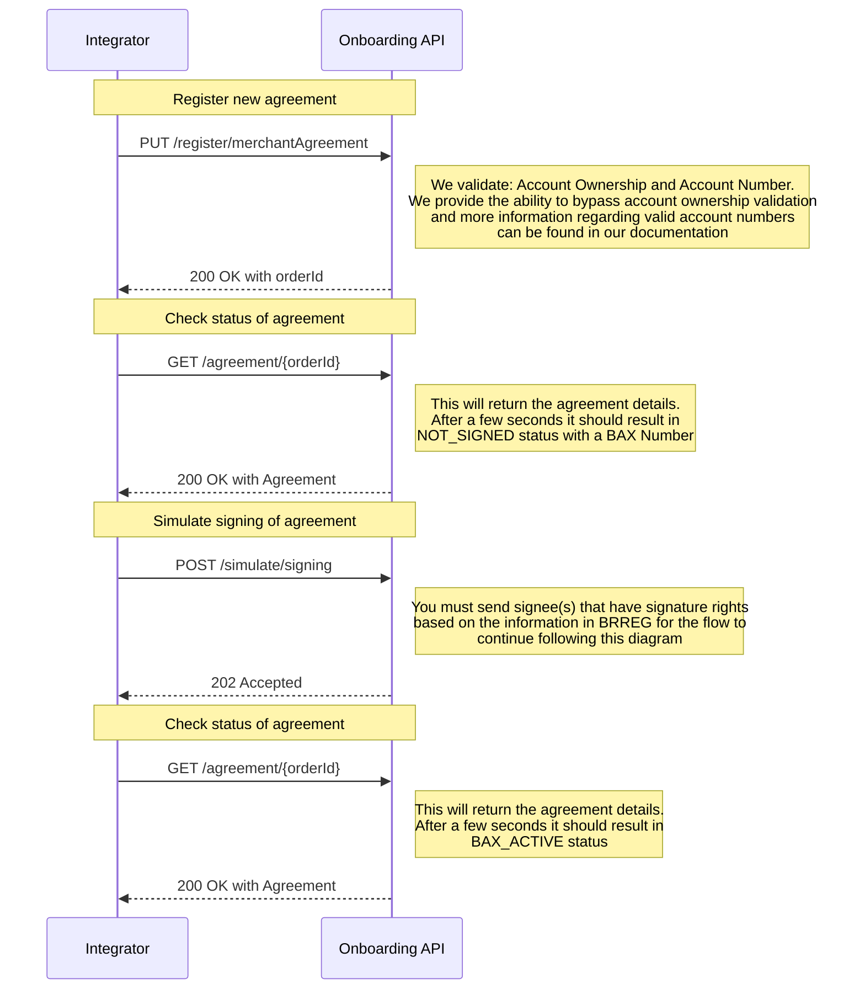
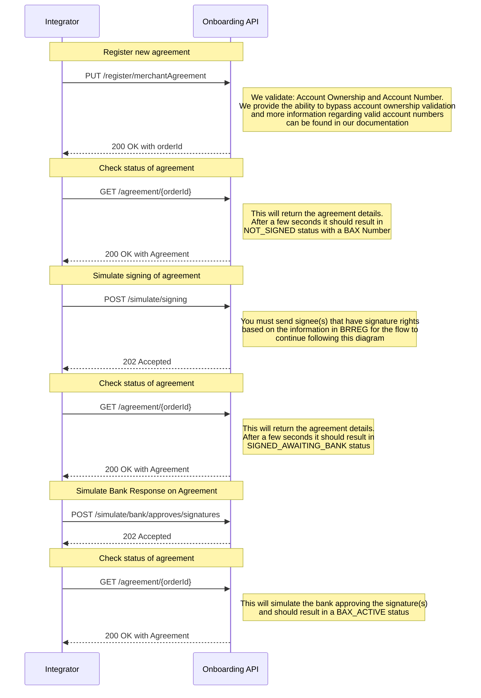
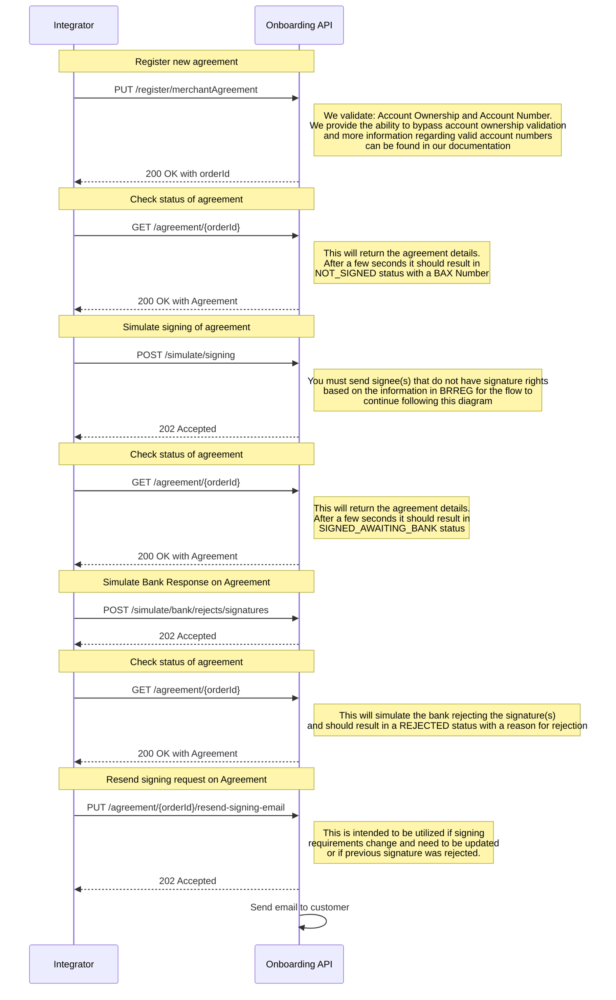
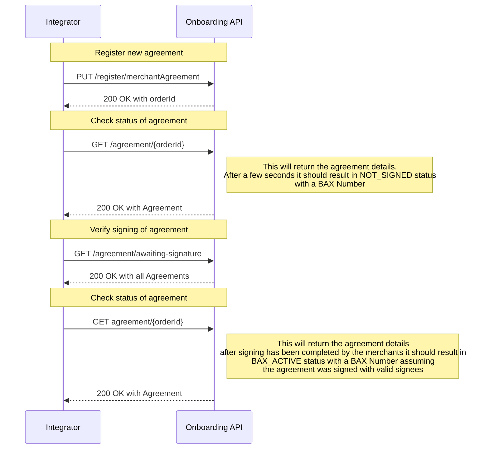
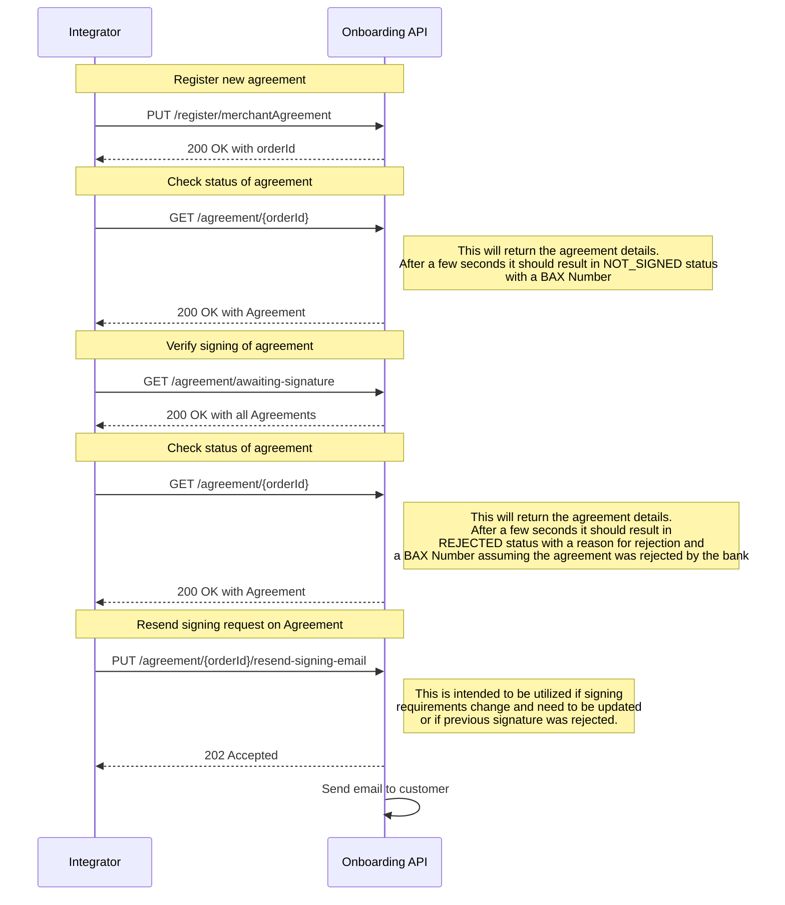
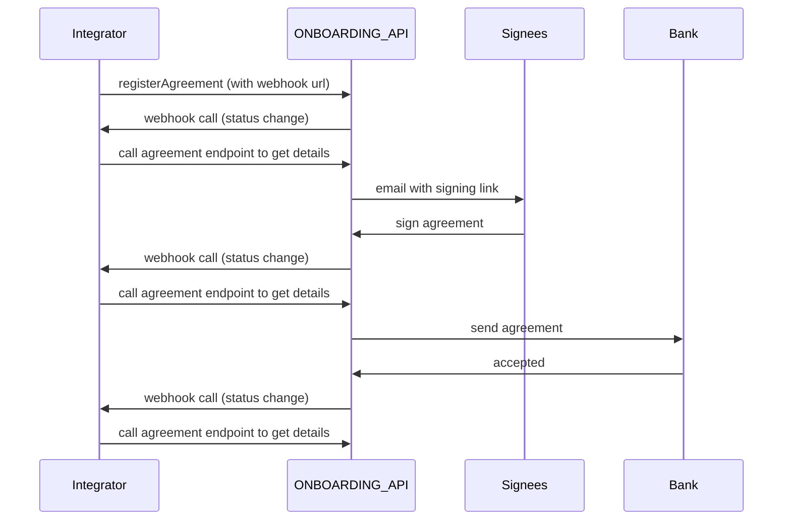

<p align="center">

</p>

> Welcome to the Getting Started guide for the BankAxept
> Onboarding API.

# Introduction

This is an API for Norwegian [PSPs](dictionary.md) to register new [Bax numbers](dictionary.md) which are automatically assigned BankAxept products.
Following a merchant agreement registration request BankAxept will:

* Create a Bax number in [Baxbis](dictionary.md)
* Create a financial agreement document between the issuing bank and the customer, if needed.
* Create an agreement between BankAxept and the customer, if needed.
* Collect any necessary signature(s) using the signee and contact information provided in the request.

Bax numbers are loaded onto payment terminals in order to connect them to the payment network.
Baxbis is the system operated by Nets which issues bax numbers and
maintains the network necessary for payment terminals to work.

## Setting up your Onboarding integration

There are multiple points of configuration that need to be aligned before you can fully utilize the Onboarding API. The necessary steps may be found in our
[Configuration Guide](./configuration.md).

## Integration Guidelines

We validate the following information when registering an agreement: <br/>
**Account Ownership**: We validate that the account number belongs to the customer. <br/>
**Account Number**: We validate that the account number is valid and belongs to the customer. <br/>
**MCC**: We validate that the [MCC](dictionary.md) is valid and supported. You can find a list of supported MCCs in our [MCC documentation](./mcc_codes.md).

### Possible Order Statuses:

| Status               | Description                                                                                                   |
|----------------------|---------------------------------------------------------------------------------------------------------------|
| BAX_NOT_CREATED      | The agreement has been created in our system but does not yet have an associated [Bax number.](dictionary.md) |
| NOT_SIGNED           | The agreement has not been signed yet.                                                                        |
| SIGNED_AWAITING_BANK | The agreement has been signed by the customer and is waiting for the bank to approve the signatures.          |
| BAX_ACTIVE           | The agreement has been activated after the signatures have been approved.                                     |
| REJECTED             | The agreement has been rejected by the bank.                                                                  |

### Test 

Account numbers are validated during the registration process. <br/> The first four digits of the account number is always the [bank reg number.](dictionary.md) <br/>
We validate that the bank reg number is in our list of valid settlement banks. <br/> For the test environment you can use **7001** and **9710** as valid bank reg numbers. <br/>

#### Valid flow for Test: An order is created with and signed by the correct signee(s) and the signatures are automatically approved


#### Valid flow for Test: An order is created with and signed by signee(s) that can not be validated based on the info in [BRREG](dictionary.md) and the signatures are automatically rejected but then approved by the bank


#### Valid flow for Test: An order is created with and signed by signee(s) that can not be validated based on the info in [BRREG](dictionary.md) and the signatures are automatically rejected and later rejected by the bank


### Production

#### Valid flow for Production: An order is created with and signed by the correct signee(s) and the signatures are approved


#### Valid flow for Production: An order is created with and signed by the incorrect signee(s) and the signatures are rejected by the bank. 


## Webhooks

Description of how we envision the webhooks flow to look like.

1. Registering an agreement
    - Add a webhook URL parameter to the register agreement endpoint ( `PUT /psp/v2/register/merchantAgreement` )
    - Security measures
      - We expect the webhook callback URL to be an open endpoint
      - In case the integrator needs to whitelist our callback, the following IP addresses are used from our end:
        - Test environment: `51.13.44.137`
        - Prod environment: `51.13.52.185`
2. When the PSP calls the `PUT /psp/v2/register/merchantAgreement` endpoint to register an agreement order, you will get an `orderId` in the response (as per the existing API spec).
   Whenever there is a change to the agreement order in our systems, we will call the webhook URL with the `orderId` in the request body, looking like this:
```
{
  "orderId": "af5505ad-4346-4c7e-8729-700bd0b92168"
}
```
3. The PSP should then call our existing endpoint to fetch the updated status ( `GET /psp/v2/register/{orderId}` )
    - The `registerMerchantOrderStatus` field in this response should give you the necessary information about the agreement registration order.


### Webhook example sequence diagram




