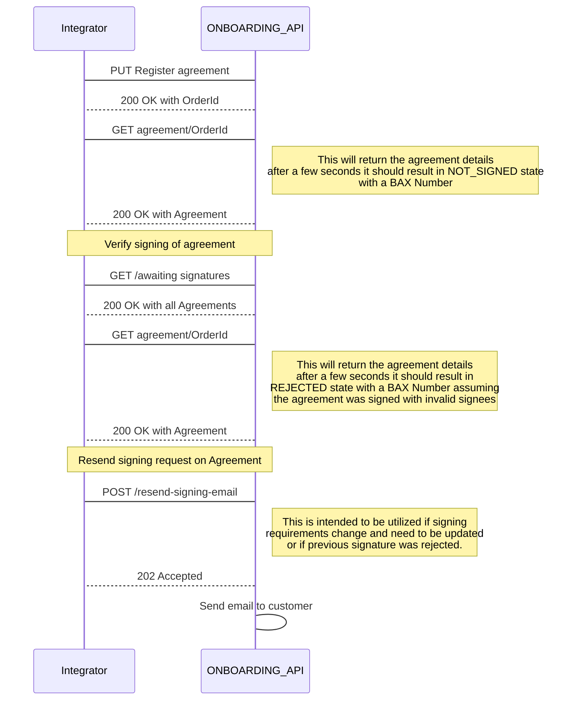
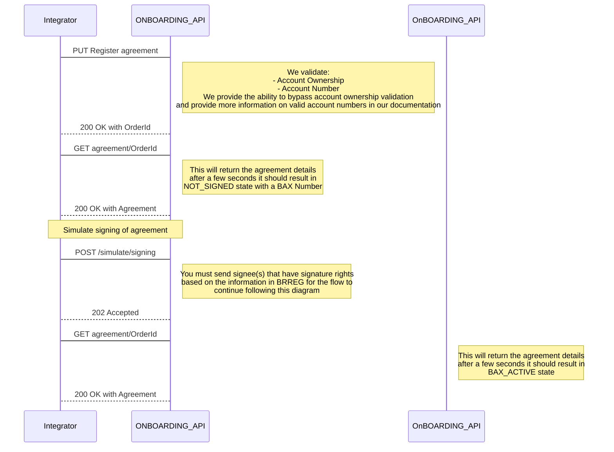
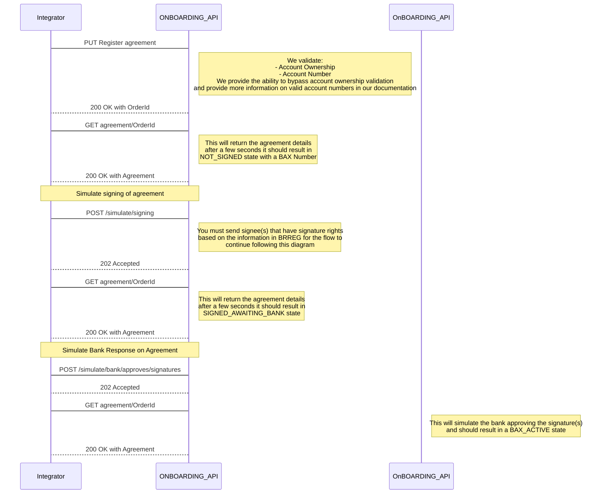
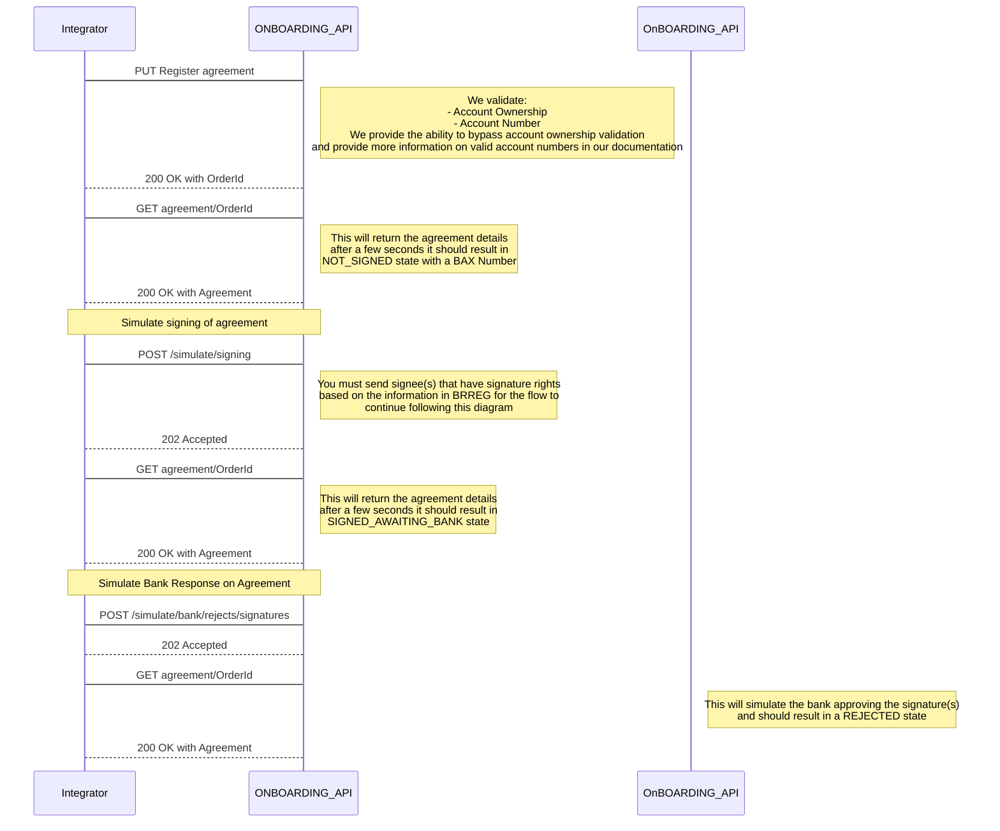

> Welcome to the Getting Started guide for the BankAxept
> Onboarding API.

# Introduction

Onboarding lets you onboard Merchants.

## Setting up your Onboarding integration

There are multiple points of configuration that need to be aligned before you can fully utilize the Onboarding API. The necessary steps may be found in our
[Configuration Guide](./configuration.md).

## Integration Guidelines

### Valid flow for Production - Happy Path 

### Valid flow for Production - Unhappy Path

### Valid flow for Test - Happy Path

### Valid flow for Test - Unhappy Path bank approves

### Valid flow for Test - Unhappy Path bank rejects

