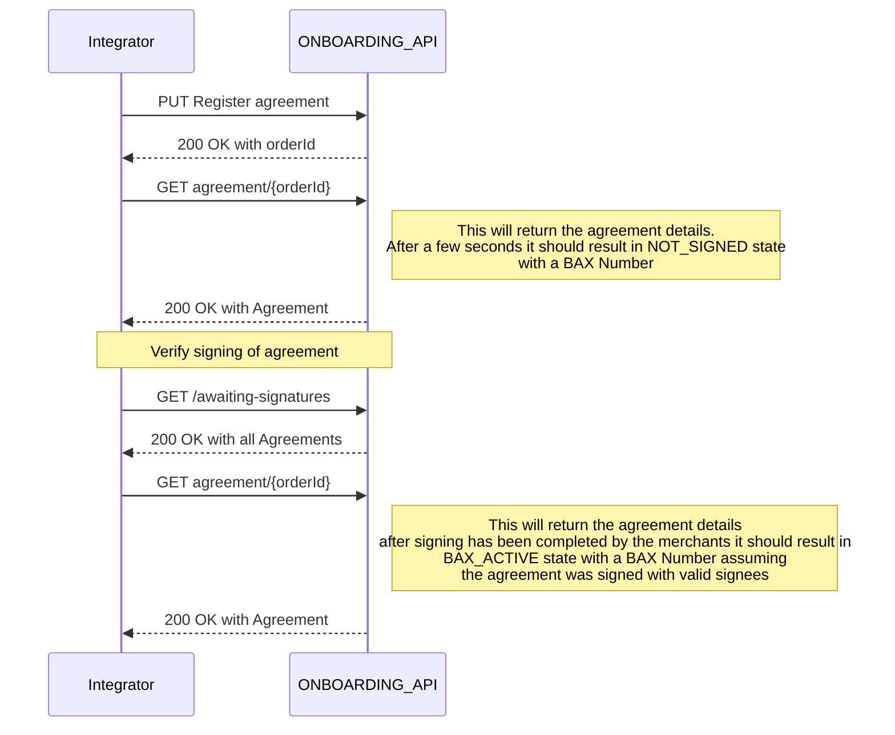
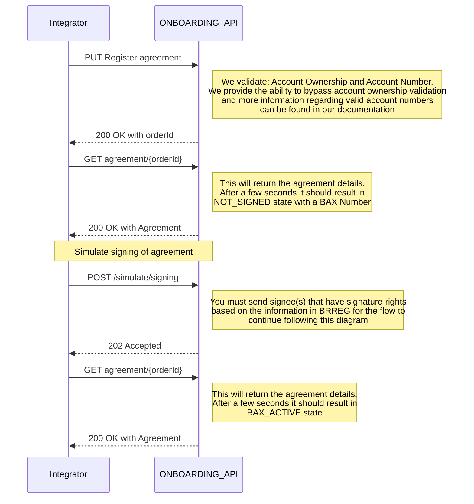
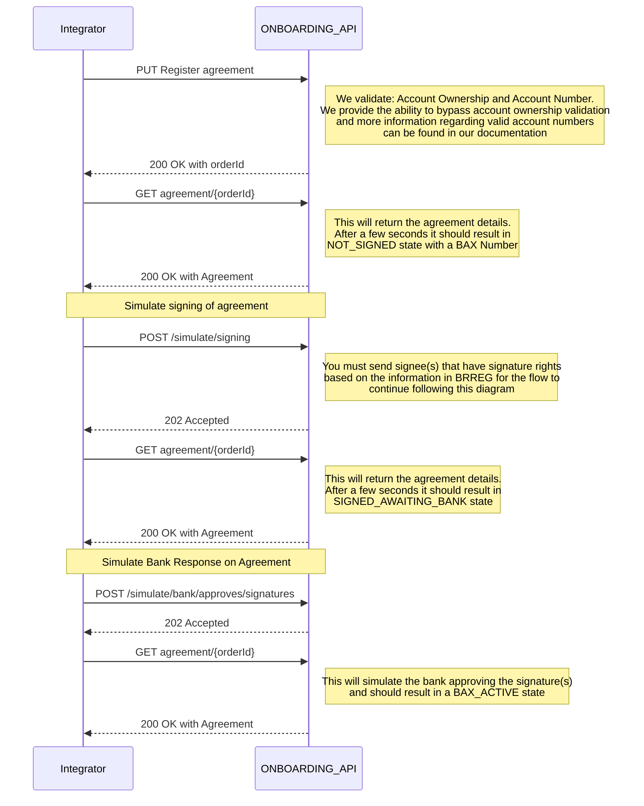
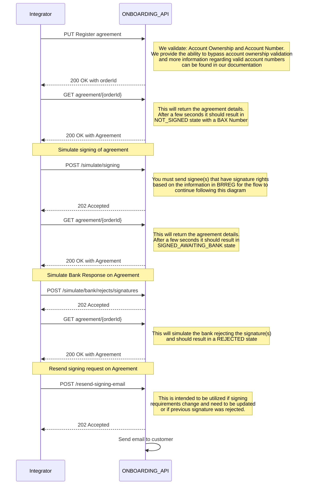
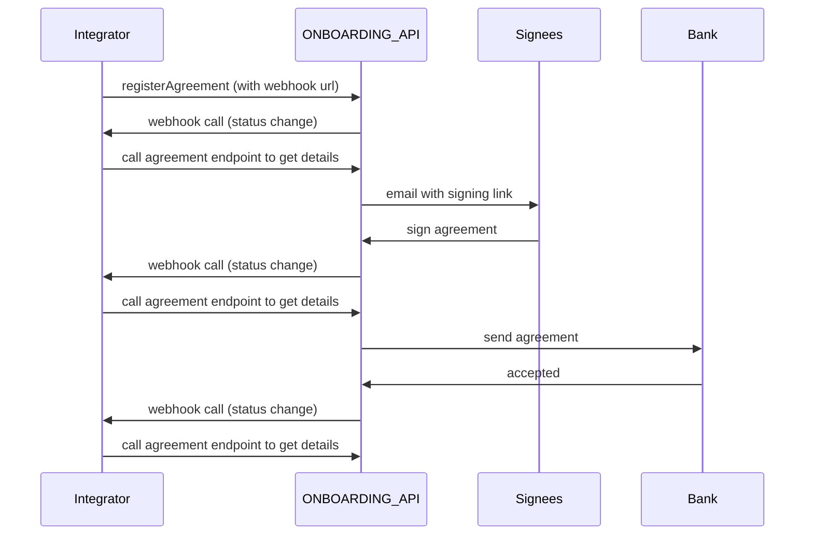

<p align="center">

</p>

> Welcome to the Getting Started guide for the BankAxept
> Onboarding API.

# Introduction

This is an API for Norwegian PSPs to register new Bax numbers which are automatically assigned BankAxept products.
Following a merchant agreement registration request BankAxept will:

* Create a Bax number in Baxbis
* Create a financial agreement document between the issuing bank and the customer, if needed.
* Create an agreement between BankAxept and the customer, if needed.
* Collect any necessary signature(s) using the signee and contact information provided in the request.

Bax numbers are loaded onto payment terminals in order to connect them to the payment network.
Baxbis is the system operated by Nets which issues bax numbers and
maintains the network necessary for payment terminals to work.

## Setting up your Onboarding integration

There are multiple points of configuration that need to be aligned before you can fully utilize the Onboarding API. The necessary steps may be found in our
[Configuration Guide](./configuration.md).

## Integration Guidelines


### Valid flow for Production - Happy Path 


### Valid flow for Production - Unhappy Path


### Valid flow for Test - Happy Path


### Valid flow for Test - Unhappy Path bank approves


### Valid flow for Test - Unhappy Path bank rejects



## Webhooks

Description of how we envision the webhooks flow to look like.

1. Registering an agreement
    - Add a webhook URL parameter to the register agreement endpoint ( `PUT /psp/v2/register/merchantAgreement` )
    - Optionally we could also get an authentication token which will be put in the header when calling the webhook to ensure the call came from us and not an attacker.
    - This URL can be an open endpoint, or other security measures must be discussed.
2. When the PSP calls the `PUT /psp/v2/register/merchantAgreement` endpoint to register an agreement order, you will get an `orderId` in the response (as per the existing API spec).
   Whenever there is a change to the agreement order in our systems, we will call the webhook URL with the `orderId` in the request body, looking like this:
```
{
  "orderId": "af5505ad-4346-4c7e-8729-700bd0b92168"
}
```
3. The PSP should then call our existing endpoint to fetch the updated status ( `GET /psp/v2/register/{orderId}` )
    - The `registerMerchantOrderStatus` field in this response should give you the necessary information about the agreement registration order.


### Webhook example sequence diagram




