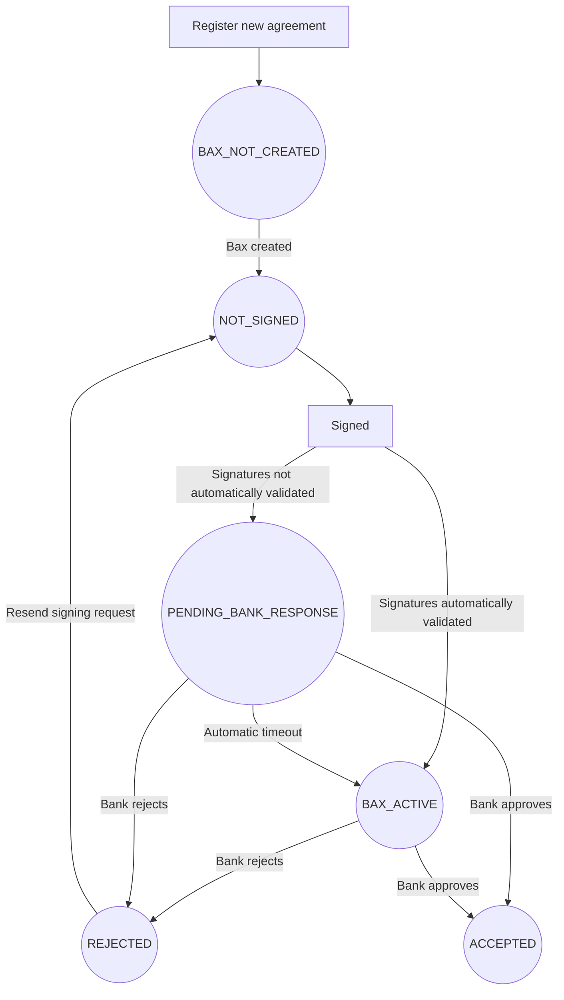

> Welcome to the Getting Started guide for the BankAxept
> Onboarding API.

# Introduction

This is an API for Norwegian [PSPs](dictionary.md) to register new [Bax numbers](dictionary.md) which are automatically assigned BankAxept products.
Following a merchant agreement registration request BankAxept will:

* Create a Bax number in [Baxbis](dictionary.md)
* Create a financial agreement document between the issuing bank and the customer, if needed.
* Create an agreement between BankAxept and the customer, if needed.
* Collect any necessary signature(s) using the signee and contact information provided in the request.

Bax numbers are loaded onto payment terminals in order to connect them to the payment network.
Baxbis is the system operated by Nets which issues bax numbers and
maintains the network necessary for payment terminals to work.

## Setting up your Onboarding integration

There are multiple points of configuration that need to be aligned before you can fully utilize the Onboarding API. The necessary steps may be found in our
[Configuration Guide](./configuration.md).

## Possible Order Statuses

| Status                | Description                                                                                                                                   |
|-----------------------|-----------------------------------------------------------------------------------------------------------------------------------------------|
| BAX_NOT_CREATED       | The agreement has been created in our system but does not yet have an associated [Bax number.](dictionary.md)                                 |
| NOT_SIGNED            | The agreement has not been signed yet.                                                                                                        |
| PENDING_BANK_RESPONSE | The agreement has been signed by the customer and is waiting for the bank to approve the signatures.                                          |
| BAX_ACTIVE            | The agreement has been activated but the bank has not given final approval.                                                                   |
| REJECTED              | The agreement has been rejected by the bank. This is not a terminal state and can be moved by calling the `/recreate-signing-order` endpoint. |
| ACCEPTED              | The agreement has received final approval from the bank. This is a terminal state.                                                            |

### Order Statuses Flowchart

## Integration Guidelines

We validate the following information when registering an agreement:  
**Account Ownership**: We validate that the account number belongs to the customer.  
**Account Number**: We validate that the account number is valid and belongs to the customer.  
**MCC**: We validate that the [MCC](dictionary.md) is valid and supported. You can find a list of supported MCCs in our [MCC documentation](./mcc_codes.md).

### Test 
Account numbers are validated during the registration process.   The first four digits of the account number is always the [bank reg number.](dictionary.md)  
We validate that the bank reg number is in our list of valid settlement banks.   For the test environment you can use **7001** and **9710** as valid bank reg numbers.  
You can view our flow diagrams for the test environment [here](./test_flows.md).

### Production
You can view our flow diagrams for the production environment [here](./prod_flows.md).  

## Webhooks
You can view more information about webhooks [here](./webhooks.md).  
