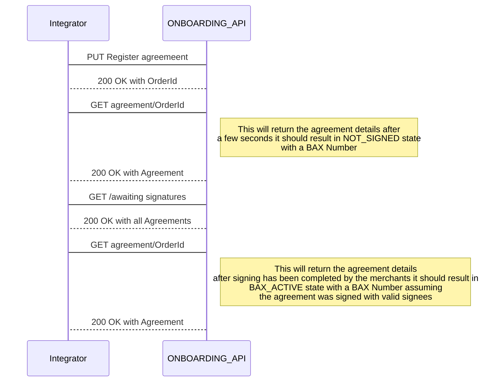

> Welcome to the Getting Started guide for the BankAxept
> DES Onboard API.

# Introduction

Onboarding lets you onboard Merchants.

## Setting up your Onboarding integration

There are multiple points of configuration that need to be aligned before you can fully utilize the DES Issuer API. The necessary steps may be found in our
[Onboarding Guide](./onboarding.md).

## Integration Guidelines

