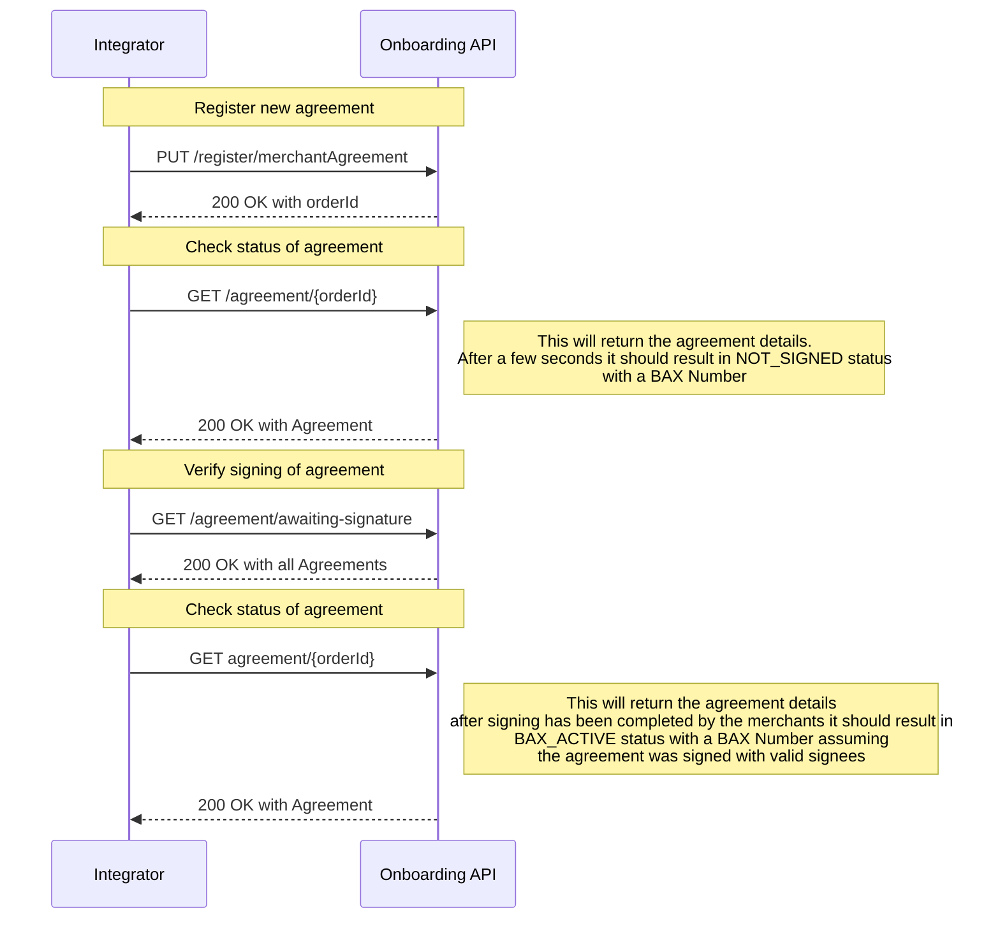
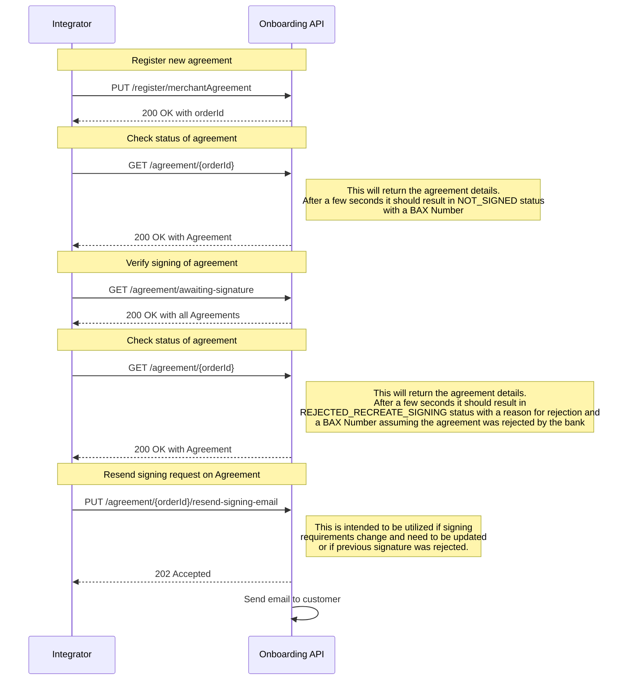

# Valid flows for Production

## Automatically Approved Signatures
An order is created with and signed by the correct signee(s) and the signatures are approved

## Signatures Rejected by Bank
An order is created with and signed by the incorrect signee(s) and the signatures are rejected by the bank.

