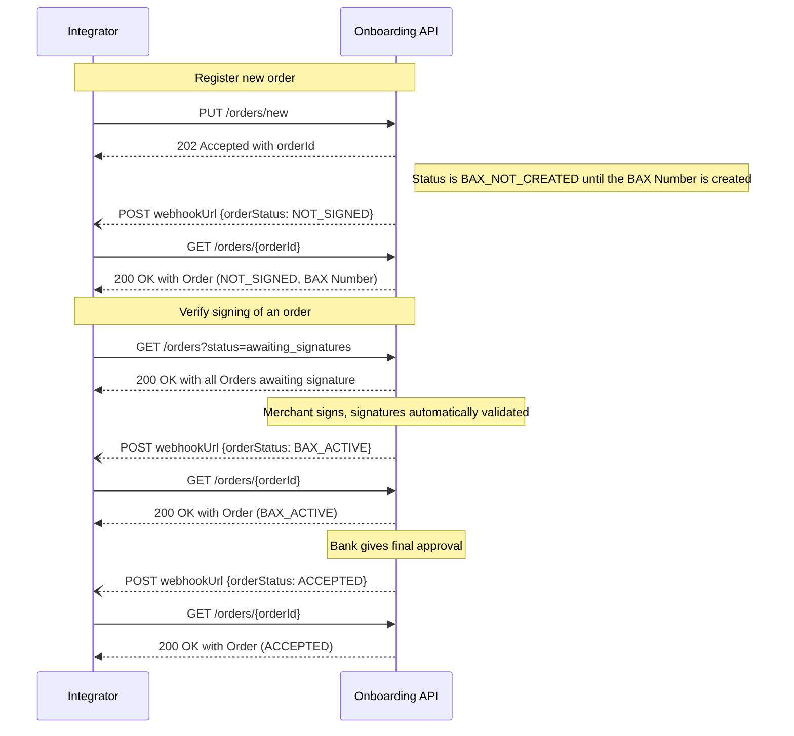
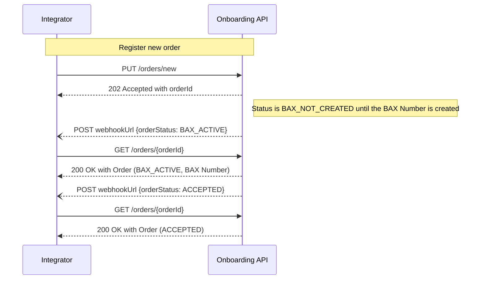
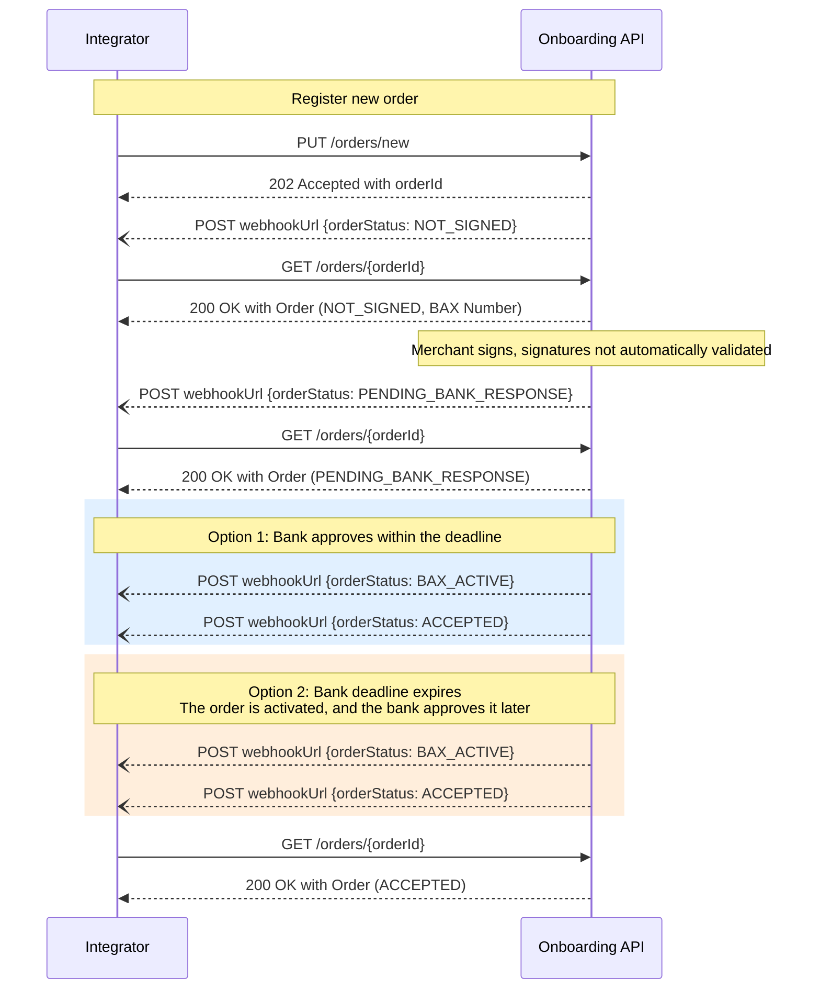
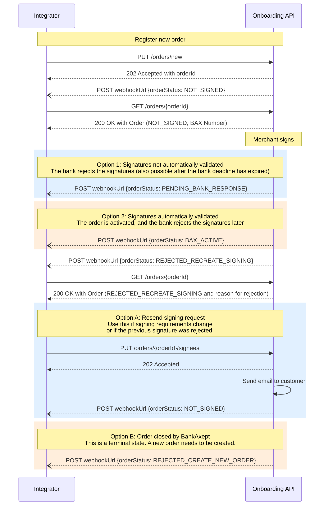

# Valid flows for Production

These diagrams show the API calls and [webhooks](./webhooks.md) for each path through the [Order Statuses Flowchart](./getting_started.md#order-statuses-flowchart).
Webhooks are shown where they are triggered. Delivery order is not guaranteed, see [Webhooks](./webhooks.md#delivery-and-ordering).
If you do not use webhooks, you can poll `GET /orders/{orderId}` instead.

## Automatically Approved Signatures
An order is created with and signed by the correct signee(s) and the signatures are approved

```mermaid
sequenceDiagram
participant I as Integrator
participant O as Onboarding API

note over I, O: Register new order
I ->> O: PUT /orders/new
O -->> I: 202 Accepted with orderId
note right of O: Status is BAX_NOT_CREATED until the BAX Number is created

O --) I: POST webhookUrl {orderStatus: NOT_SIGNED}
I ->> O : GET /orders/{orderId}
O -->> I: 200 OK with Order (NOT_SIGNED, BAX Number)

note over I, O: Verify signing of an order
I ->> O: GET /orders?status=awaiting_signatures
O -->> I: 200 OK with all Orders awaiting signature

note over O: Merchant signs, signatures automatically validated
O --) I: POST webhookUrl {orderStatus: BAX_ACTIVE}
I ->> O : GET /orders/{orderId}
O -->> I: 200 OK with Order (BAX_ACTIVE)

note over O: Bank gives final approval
O --) I: POST webhookUrl {orderStatus: ACCEPTED}
I ->> O : GET /orders/{orderId}
O -->> I: 200 OK with Order (ACCEPTED)
```

## No Signing Required
An order is created for a customer where no signing is required, and the order is completed without a signing step

```mermaid
sequenceDiagram
participant I as Integrator
participant O as Onboarding API

note over I, O: Register new order
I ->> O: PUT /orders/new
O -->> I: 202 Accepted with orderId
note right of O: Status is BAX_NOT_CREATED until the BAX Number is created

O --) I: POST webhookUrl {orderStatus: BAX_ACTIVE}
I ->> O : GET /orders/{orderId}
O -->> I: 200 OK with Order (BAX_ACTIVE, BAX Number)

O --) I: POST webhookUrl {orderStatus: ACCEPTED}
I ->> O : GET /orders/{orderId}
O -->> I: 200 OK with Order (ACCEPTED)
```

## Signatures Approved by Bank
An order is created and signed by signee(s) that can not be automatically validated, and the bank approves the signatures

```mermaid
sequenceDiagram
participant I as Integrator
participant O as Onboarding API

note over I, O: Register new order
I ->> O: PUT /orders/new
O -->> I: 202 Accepted with orderId

O --) I: POST webhookUrl {orderStatus: NOT_SIGNED}
I ->> O : GET /orders/{orderId}
O -->> I: 200 OK with Order (NOT_SIGNED, BAX Number)

note over O: Merchant signs, signatures not automatically validated
O --) I: POST webhookUrl {orderStatus: PENDING_BANK_RESPONSE}
I ->> O : GET /orders/{orderId}
O -->> I: 200 OK with Order (PENDING_BANK_RESPONSE)

rect rgb(225, 240, 255)
note over I, O: Option 1: Bank approves within the deadline
O --) I: POST webhookUrl {orderStatus: BAX_ACTIVE}
O --) I: POST webhookUrl {orderStatus: ACCEPTED}
end
rect rgb(255, 238, 220)
note over I, O: Option 2: Bank deadline expires <br/> The order is activated, and the bank approves it later
O --) I: POST webhookUrl {orderStatus: BAX_ACTIVE}
O --) I: POST webhookUrl {orderStatus: ACCEPTED}
end
I ->> O : GET /orders/{orderId}
O -->> I: 200 OK with Order (ACCEPTED)
```

## Signatures Rejected by Bank
An order is created with and signed by the incorrect signee(s) and the signatures are rejected by the bank.

```mermaid
sequenceDiagram
participant I as Integrator
participant O as Onboarding API

note over I, O: Register new order
I ->> O: PUT /orders/new
O -->> I: 202 Accepted with orderId

O --) I: POST webhookUrl {orderStatus: NOT_SIGNED}
I ->> O : GET /orders/{orderId}
O -->> I: 200 OK with Order (NOT_SIGNED, BAX Number)

note over O: Merchant signs
rect rgb(225, 240, 255)
note over I, O: Option 1: Signatures not automatically validated <br/> The bank rejects the signatures (also possible after the bank deadline has expired)
O --) I: POST webhookUrl {orderStatus: PENDING_BANK_RESPONSE}
end
rect rgb(255, 238, 220)
note over I, O: Option 2: Signatures automatically validated <br/> The order is activated, and the bank rejects the signatures later
O --) I: POST webhookUrl {orderStatus: BAX_ACTIVE}
end
O --) I: POST webhookUrl {orderStatus: REJECTED_RECREATE_SIGNING}
I ->> O : GET /orders/{orderId}
O -->> I: 200 OK with Order (REJECTED_RECREATE_SIGNING and reason for rejection)

rect rgb(225, 240, 255)
note over I, O: Option A: Resend signing request <br/> Use this if signing requirements change <br/> or if the previous signature was rejected.
I ->> O: PUT /orders/{orderId}/signees
O -->> I: 202 Accepted
O ->> O: Send email to customer
O --) I: POST webhookUrl {orderStatus: NOT_SIGNED}
end
rect rgb(255, 238, 220)
note over I, O: Option B: Order closed by BankAxept <br/> This is a terminal state. A new order needs to be created.
O --) I: POST webhookUrl {orderStatus: REJECTED_CREATE_NEW_ORDER}
end
```
