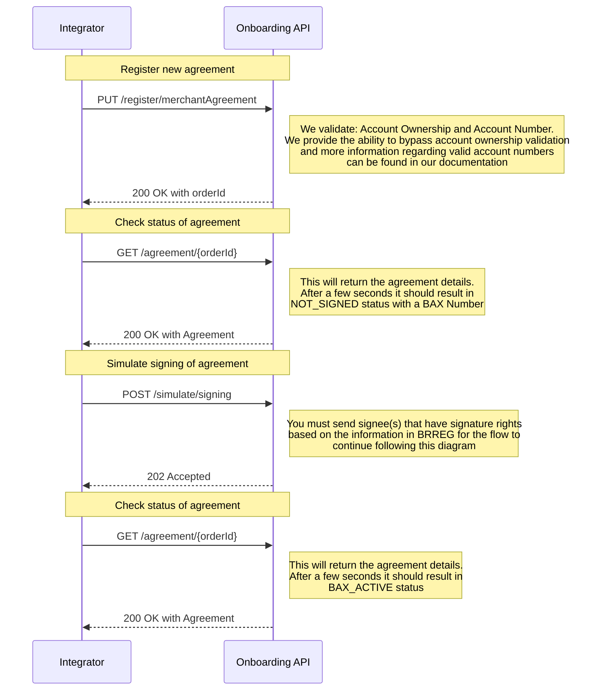
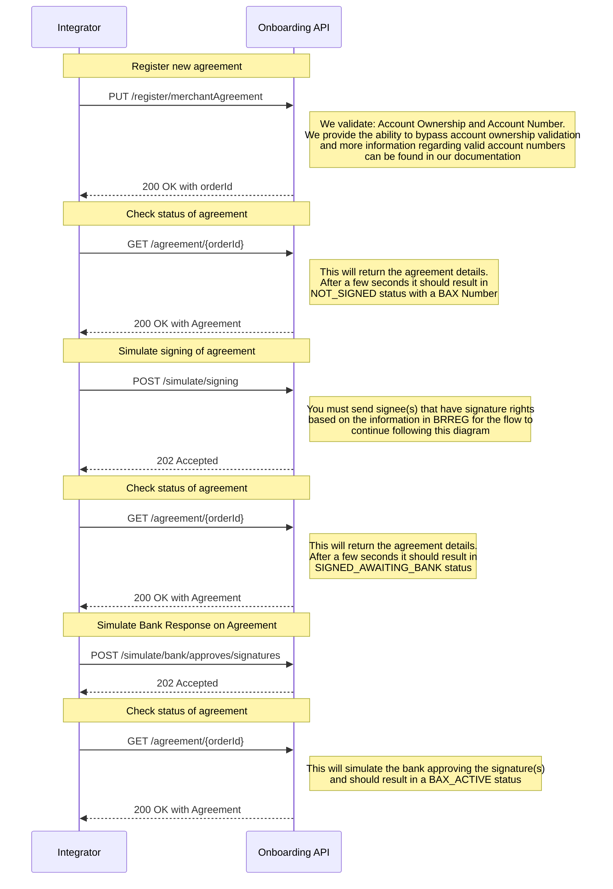
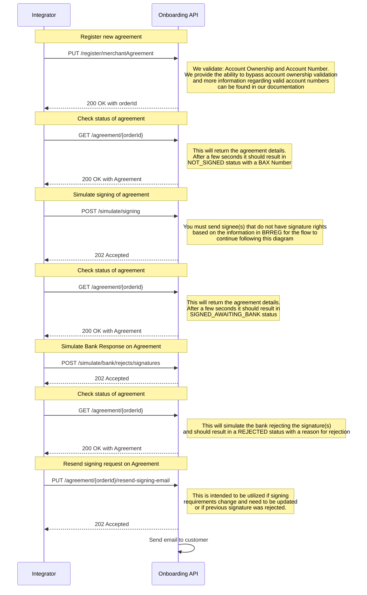

# Valid flows for Test

## Automatically Approved Signatures
An order is created with and signed by the correct signee(s) and the signatures are automatically approved

## Signatures Approved by Bank
An order is created with and signed by signee(s) that can not be validated based on the info in [BRREG](dictionary.md) and the signatures are automatically rejected but then approved by the bank

## Signatures Rejected by Bank
An order is created with and signed by signee(s) that can not be validated based on the info in [BRREG](dictionary.md) and the signatures are automatically rejected and later rejected by the bank

