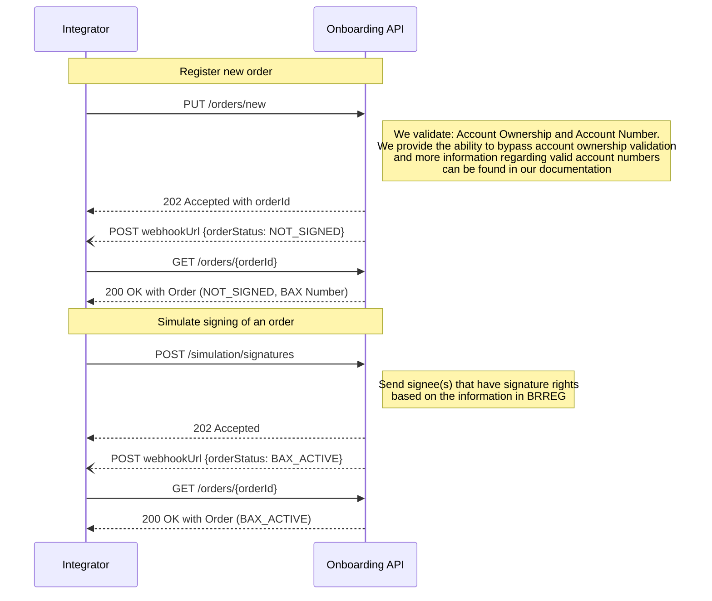
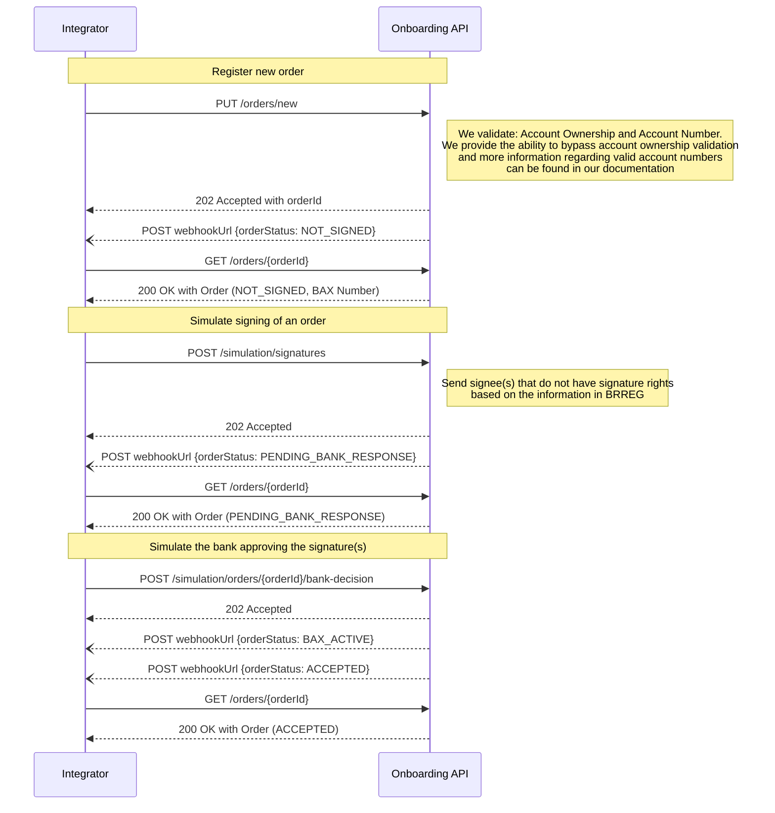
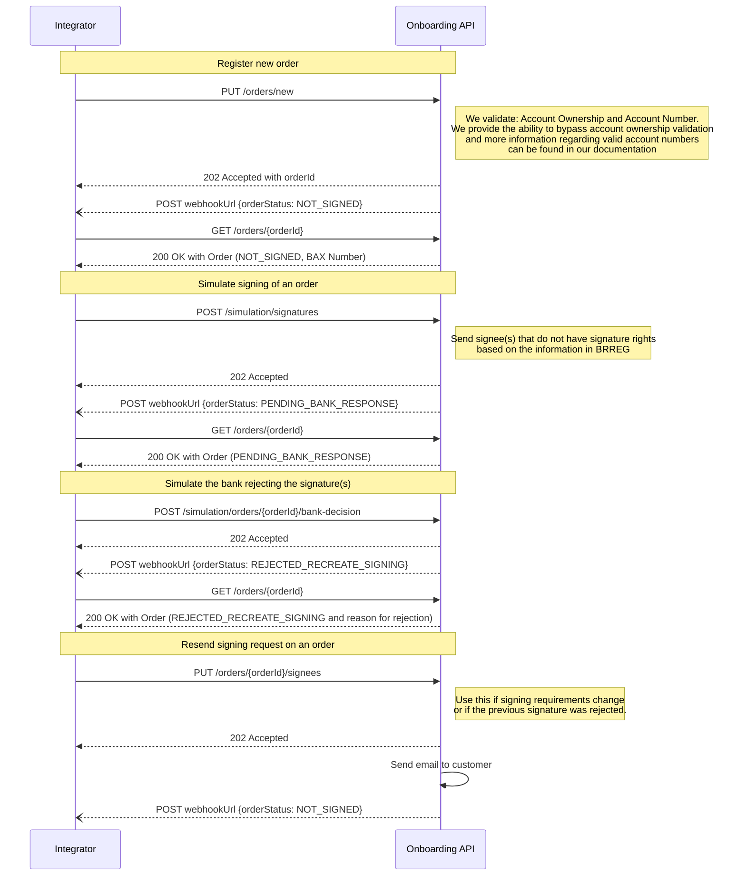

# Valid flows for Test

These diagrams show the API calls and [webhooks](./webhooks.md) for each path through the [Order Statuses Flowchart](./getting_started.md#order-statuses-flowchart).
Webhooks are shown where they are triggered. Delivery order is not guaranteed, see [Webhooks](./webhooks.md#delivery-and-ordering).
If you do not use webhooks, you can poll `GET /orders/{orderId}` instead.

## Automatically Approved Signatures
An order is created with and signed by the correct signee(s) and the signatures are automatically approved

```mermaid
sequenceDiagram
participant I as Integrator
participant O as Onboarding API

note over I, O: Register new order
I ->> O: PUT /orders/new
note right of O: We validate: Account Ownership and Account Number. <br/> We provide the ability to bypass account ownership validation <br/> and more information regarding valid account numbers <br/> can be found in our documentation
O -->> I: 202 Accepted with orderId

O --) I: POST webhookUrl {orderStatus: NOT_SIGNED}
I ->> O : GET /orders/{orderId}
O -->> I: 200 OK with Order (NOT_SIGNED, BAX Number)

note over I, O: Simulate signing of an order
I ->> O: POST /simulation/signatures
note right of O: Send signee(s) that have signature rights <br/> based on the information in BRREG
O -->> I: 202 Accepted

O --) I: POST webhookUrl {orderStatus: BAX_ACTIVE}
I ->> O : GET /orders/{orderId}
O -->> I: 200 OK with Order (BAX_ACTIVE)
```

## Signatures Approved by Bank
An order is created with and signed by signee(s) that can not be validated based on the info in [BRREG](dictionary.md) and the signatures are automatically rejected but then approved by the bank

```mermaid
sequenceDiagram
participant I as Integrator
participant O as Onboarding API

note over I, O: Register new order
I ->> O: PUT /orders/new
note right of O: We validate: Account Ownership and Account Number. <br/> We provide the ability to bypass account ownership validation <br/> and more information regarding valid account numbers <br/> can be found in our documentation
O -->> I: 202 Accepted with orderId

O --) I: POST webhookUrl {orderStatus: NOT_SIGNED}
I ->> O : GET /orders/{orderId}
O -->> I: 200 OK with Order (NOT_SIGNED, BAX Number)

note over I, O: Simulate signing of an order
I ->> O: POST /simulation/signatures
note right of O: Send signee(s) that do not have signature rights <br/> based on the information in BRREG
O -->> I: 202 Accepted

O --) I: POST webhookUrl {orderStatus: PENDING_BANK_RESPONSE}
I ->> O : GET /orders/{orderId}
O -->> I: 200 OK with Order (PENDING_BANK_RESPONSE)

note over I, O: Simulate the bank approving the signature(s)
I ->> O: POST /simulation/orders/{orderId}/bank-decision
O -->> I: 202 Accepted

O --) I: POST webhookUrl {orderStatus: BAX_ACTIVE}
O --) I: POST webhookUrl {orderStatus: ACCEPTED}
I ->> O : GET /orders/{orderId}
O -->> I: 200 OK with Order (ACCEPTED)
```

## Signatures Rejected by Bank
An order is created with and signed by signee(s) that can not be validated based on the info in [BRREG](dictionary.md) and the signatures are automatically rejected and later rejected by the bank

```mermaid
sequenceDiagram
participant I as Integrator
participant O as Onboarding API

note over I, O: Register new order
I ->> O: PUT /orders/new
note right of O: We validate: Account Ownership and Account Number. <br/> We provide the ability to bypass account ownership validation <br/> and more information regarding valid account numbers <br/> can be found in our documentation
O -->> I: 202 Accepted with orderId

O --) I: POST webhookUrl {orderStatus: NOT_SIGNED}
I ->> O : GET /orders/{orderId}
O -->> I: 200 OK with Order (NOT_SIGNED, BAX Number)

note over I, O: Simulate signing of an order
I ->> O: POST /simulation/signatures
note right of O: Send signee(s) that do not have signature rights <br/> based on the information in BRREG
O -->> I: 202 Accepted

O --) I: POST webhookUrl {orderStatus: PENDING_BANK_RESPONSE}
I ->> O : GET /orders/{orderId}
O -->> I: 200 OK with Order (PENDING_BANK_RESPONSE)

note over I, O: Simulate the bank rejecting the signature(s)
I ->> O: POST /simulation/orders/{orderId}/bank-decision
O -->> I: 202 Accepted

O --) I: POST webhookUrl {orderStatus: REJECTED_RECREATE_SIGNING}
I ->> O : GET /orders/{orderId}
O -->> I: 200 OK with Order (REJECTED_RECREATE_SIGNING and reason for rejection)

note over I, O: Resend signing request on an order
I ->> O: PUT /orders/{orderId}/signees
note right of O: Use this if signing requirements change <br/> or if the previous signature was rejected.
O -->> I: 202 Accepted
O ->> O: Send email to customer
O --) I: POST webhookUrl {orderStatus: NOT_SIGNED}
```
