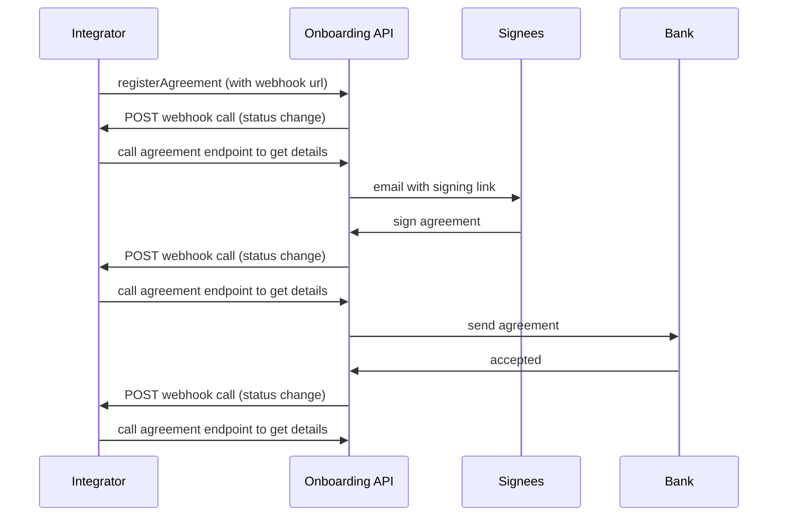

# Webhooks
Description of how we envision the webhooks flow to look like.

1. Registering an agreement
    - Add a webhookUrl property to the register merchantAgreement payload ( `PUT /psp/v2/register/merchantAgreement` )
    - Security measures
        - We expect the webhook callback URL to be an open endpoint
        - In case the integrator needs to whitelist our callback, the following IP addresses are used from our end:
            - Test environment: `51.13.44.137`
            - Prod environment: `51.13.52.185`
2. When the PSP calls the `PUT /psp/v2/register/merchantAgreement` endpoint to register an agreement order, you will get an `orderId` in the response (as per the existing API spec).
   Whenever there is a change to the agreement order in our systems, we will do a POST call to the webhook URL with the `orderId` in the request body, looking like this:
```
{
  "orderId": "af5505ad-4346-4c7e-8729-700bd0b92168"
}
```
3. The PSP should then call our existing endpoint to fetch the updated status ( `GET /psp/v2/register/{orderId}` )
    - The `registerMerchantOrderStatus` field in this response should give you the necessary information about the agreement registration order.


## Webhook example sequence diagram


