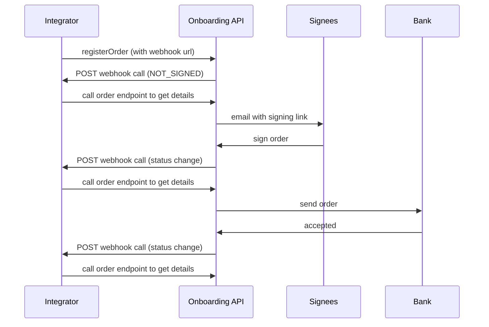

# Webhooks
This is how the webhook flow works:

1. When registering an order
    - Add a webhookUrl property to the register bax request payload ( `PUT /psp/v2/orders/new` )
    - Security measures
        - We expect the webhook callback URL to be an open endpoint
        - In case the integrator needs to whitelist our callback, the following IP addresses are used from our end:
            - Test environment: `51.13.44.137`
            - Prod environment: `51.13.52.185`
2. When the PSP calls the `PUT /psp/v2/orders/new` endpoint to register an agreement order, you will get an `orderId` in the response (as per the existing API spec).
   Whenever there is a change to the agreement order in our systems, we will do a POST call to the webhookUrl with the `orderId` in the request body, looking like this:
```
{
  "orderId": "af5505ad-4346-4c7e-8729-700bd0b92168",
  "orderStatus": "PENDING_BANK_RESPONSE"
}
```
where the `orderStatus` refers to the statuses defined in the [Possible Order Statuses](getting_started.md#possible-order-statuses)

3. The PSP should then call our existing endpoint to fetch the updated status ( `GET /psp/v2/orders/{orderId}` )
    - The `orderStatus` field in this response should give you the necessary information about the agreement registration order.

No webhook is sent when the order is registered (`BAX_NOT_CREATED`). The first webhook is sent once the BAX Number has been created. This is usually `NOT_SIGNED`, but if no signing is required the first webhook will be `BAX_ACTIVE`.

## Delivery and ordering
Webhooks are sent asynchronously every time an order changes status, and failed calls are retried for a couple of minutes. They are not guaranteed to arrive immediately, in the order the status changes happened, or at all. This means:

- You may receive the same webhook more than once, with the same `orderStatus` (for example `BAX_ACTIVE`).
- The `orderStatus` in a webhook may already be outdated when you receive it.
- If your endpoint is unavailable for more than a couple of minutes (for example during a deployment), a webhook can be lost.

Your endpoint should respond with a `2xx` status code to confirm that it received the webhook. Treat a webhook as a signal to call `GET /psp/v2/orders/{orderId}`, and use that response as the current status of the order. If you depend on status updates, also poll for the status of orders that have not reached a terminal state, in case a webhook was lost.

You can see where webhooks are triggered in each flow in the flow diagrams for [Production](./prod_flows.md) and [Test](./test_flows.md).

## Webhook example sequence diagram


```mermaid
sequenceDiagram
    participant Integrator
    participant Onboarding API
    participant Signees
    participant Bank
    Integrator->>Onboarding API: registerOrder (with webhook url)
    Onboarding API->>Integrator: POST webhook call (NOT_SIGNED)
    Integrator->>Onboarding API: call order endpoint to get details
    Onboarding API->>Signees: email with signing link
    Signees->>Onboarding API: sign order
    Onboarding API->>Integrator: POST webhook call (status change)
    Integrator->>Onboarding API: call order endpoint to get details
    Onboarding API->>Bank: send order
    Bank->>Onboarding API: accepted
    Onboarding API->>Integrator: POST webhook call (status change)
    Integrator->>Onboarding API: call order endpoint to get details
```
